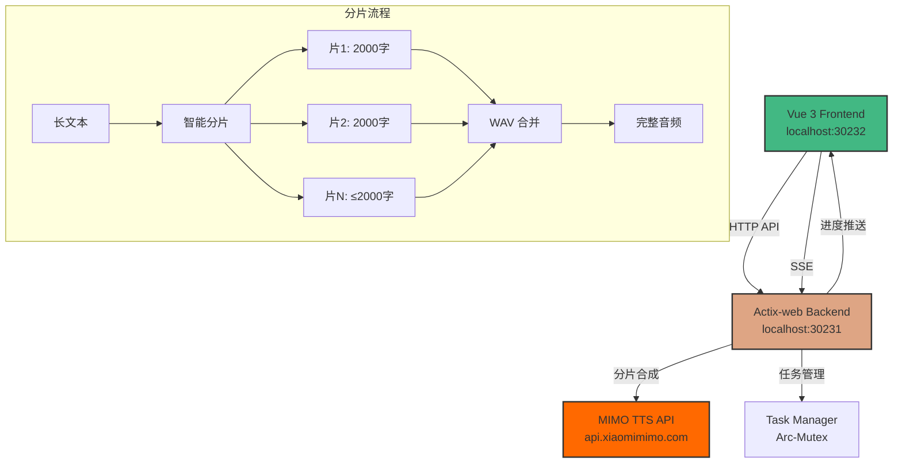

# MIMO v2.5 TTS Web 服务


基于 Rust + Actix-web + Vue 3 的小米 MIMO v2.5 TTS 语音合成 Web 服务

## 功能特性

### 核心功能
- ✅ 完整的 TTS 合成工作流（文本 → 音频）
- ✅ 多任务并发管理与状态追踪
- ✅ 实时任务状态展示（SSE 推送）
- ✅ 音频在线播放与下载（支持 HTTP Range seek）
- ✅ Token/字符实时统计
- ✅ 8 种预置音色切换
- ✅ 自然语言风格控制
- ✅ 自定义任务名称
- ✅ API Key 占位符自动检测（Vercel Gateway）

### 智能分片合成
- ✅ **超长文本自动分片**：按句子边界智能分割，每片 ≤2000 字
- ✅ **均匀分配算法**：先算最优片数，再均匀分配，避免碎片
- ✅ **WAV 音频合并**：多片音频自动拼接为完整文件
- ✅ **分片进度显示**：前端实时显示 "第 X/Y 片"
- ✅ **API 流控**：滑动窗口速率限制器（10 RPM），分片间延迟 6.5 秒

### UI/UX
- ✅ Card 布局任务列表（shadcn-vue 组件）
- ✅ 可编辑任务标题（双击编辑）
- ✅ 时间显示：今日/昨日/日期智能切换
- ✅ 暗色模式支持
- ✅ 响应式布局（移动端适配）

### 音频播放器
- ✅ 播放/暂停状态事件驱动（解决 autoplay 阻止问题）
- ✅ 倍速播放（0.5x / 1x / 1.5x / 2x）
- ✅ 音量控制与静音
- ✅ 进度条拖拽 seek
- ✅ 原文文本同步显示

## 技术亮点

### 1. 智能文本分片策略

```rust
// 核心算法：先算最优片数，再均匀分配
let chunk_count = ceil(total_chars / MAX_CHUNK);
let target_size = total_chars / chunk_count;

// 贪心合并：累积句子直到接近 target_size
for sentence in sentences {
    if current_size >= target_size {
        save_chunk();
    }
    add_sentence(sentence);
}
```

**效果对比**：
| 文本长度 | 旧策略 | 新策略 |
|---------|--------|--------|
| 2001 字 | [2000]+[1] | [1001]+[1000] |
| 5000 字 | [2000]+[2000]+[1000] | [1667]+[1667]+[1666] |

### 2. WAV 音频合并

```rust
// 正确解析 WAV 头格式
let num_channels = u16::from_le_bytes([header[22], header[23]]);
let sample_rate = u32::from_le_bytes([header[24], header[25], header[26], header[27]]);
let bits_per_sample = u16::from_le_bytes([header[34], header[35]]);

// 预分配缓冲区，减少内存拷贝
let mut all_pcm_data = Vec::with_capacity(total_pcm_size);
```

### 3. API 流控机制

```rust
// 滑动窗口速率限制器（VecDeque 优化）
struct RateLimiter {
    request_times: VecDeque<Instant>,
    max_rpm: usize,  // 10 次/分钟
}

// 分片间延迟
const CHUNK_DELAY_MS: u64 = 6500;  // 6.5 秒
```

### 4. 异步并发控制

使用 `tokio::sync::Semaphore` 限制同时合成的任务数：

```rust
let semaphore = Arc::new(Semaphore::new(max_concurrent_tasks));
let permit = semaphore.acquire().await?;
// 执行合成任务
drop(permit);
```

### 5. 实时状态推送

基于 Server-Sent Events (SSE) 实现单向实时通信：

```rust
HttpResponse::Ok()
    .content_type("text/event-stream")
    .streaming(task_event_stream(task_id))
```

## 系统架构



## 技术栈

### 后端
- **Rust** + **Actix-web 4.x** - 高性能异步 Web 框架
- **tokio** - 异步运行时
- **reqwest** - HTTP 客户端（调用 MIMO API）
- **serde** - 序列化/反序列化
- **tracing** - 结构化日志

### 前端
- **Vue 3.5** + **Vite 6** - 现代化前端框架
- **TypeScript** - 类型安全
- **Tailwind CSS 4** - 原子化 CSS
- **shadcn-vue** - UI 组件库
- **Pinia** - 状态管理
- **vue-sonner** - Toast 通知

## 快速开始

### 前置要求

- Rust 1.70+ (后端)
- Node.js 18+ (前端)
- MIMO API Key ([申请地址](https://platform.xiaomimimo.com/))

### 后端启动

```bash
cd backend

# 复制环境变量配置
cp .env.example .env

# 编辑 .env 文件，填入你的 MIMO_API_KEY
# MIMO_API_KEY=your_api_key_here

# 运行服务器
cargo run --release

# 或使用 watch 模式（需要 cargo-watch）
cargo watch -x run
```

后端服务将启动在 `http://localhost:30231`

### 前端启动

```bash
cd frontend

# 安装依赖
npm install

# 开发模式
npm run dev -- --port 30232

# 生产构建
npm run build
```

前端开发服务器将启动在 `http://localhost:30232`

### 生产部署

```bash
# 构建前端
cd frontend
npm run build

# 后端服务静态文件
cd ../backend
cargo run --release
```

访问 `http://localhost:30231` 即可使用完整应用。

## API 文档

### TTS 合成

**请求**：

```bash
curl -X POST http://localhost:30231/api/v1/tts/synthesize \
  -H "Content-Type: application/json" \
  -d '{
    "text": "你好，世界",
    "voice": "zhifeng_16k",
    "model": "mimo-v2.5-tts",
    "api_key": "your_api_key_here"
  }'
```

**响应**（200 OK）：

```json
{
  "task_id": "019e493e-a76d-78d2-a0fd-2af9731a101d",
  "status": "pending",
  "token_count": 8,
  "char_count": 5,
  "message": "任务已创建，正在合成中"
}
```

### 任务管理

| 端点 | 方法 | 说明 |
|------|------|------|
| `/api/v1/tasks` | GET | 获取所有任务 |
| `/api/v1/tasks/{id}` | GET | 获取任务详情 |
| `/api/v1/tasks/{id}` | DELETE | 删除任务 |
| `/api/v1/tasks/{id}/audio` | GET | 下载音频（支持 Range） |
| `/api/v1/tasks/{id}/title` | PATCH | 更新任务标题 |
| `/api/v1/voices` | GET | 获取音色列表 |

### 音频下载（HTTP Range）

支持断点续传和进度条 seek：

```bash
# 完整下载
curl -O http://localhost:30231/api/v1/tasks/{id}/audio

# 部分下载（Range 请求）
curl -H "Range: bytes=0-1023" http://localhost:30231/api/v1/tasks/{id}/audio
```

## 配置说明

### 环境变量

| 变量名 | 说明 | 默认值 |
|--------|------|--------|
| `MIMO_API_KEY` | MIMO API 密钥 | 无 |
| `MAX_CONCURRENT_TASKS` | 最大并发任务数 | 5 |
| `TASK_CLEANUP_HOURS` | 任务清理时间（小时） | 24 |

### API 限制

| 限制项 | 值 |
|--------|-----|
| RPM（每分钟请求数） | 10 |
| TPM（每分钟 Token） | 1M |
| 单次最大文本长度 | 2000 字 |
| 超长文本 | 自动分片合成 |

## 开发指南

### 运行测试

```bash
# 后端测试
cd backend
cargo test

# 前端类型检查
cd frontend
npm run build
```

### 项目结构

```
UMMimoTTS/
├── backend/
│   ├── src/
│   │   ├── main.rs           # 入口文件
│   │   ├── routes/           # API 路由
│   │   │   ├── tasks.rs      # 任务管理
│   │   │   ├── tts.rs        # TTS 合成
│   │   │   └── voices.rs     # 音色管理
│   │   ├── services/         # 业务逻辑
│   │   │   ├── mimo_client.rs    # MIMO API 客户端（分片+流控）
│   │   │   └── task_manager.rs   # 任务管理器
│   │   ├── models/           # 数据模型
│   │   └── state/            # 应用状态
│   └── Cargo.toml
├── frontend/
│   ├── src/
│   │   ├── components/       # Vue 组件
│   │   │   ├── TaskItem.vue      # 任务卡片
│   │   │   ├── AudioPlayerDialog.vue  # 音频播放器
│   │   │   └── SynthesizeForm.vue     # 合成表单
│   │   ├── stores/           # Pinia 状态
│   │   └── api/              # API 客户端
│   └── package.json
└── README.md
```

## 更新日志

### v1.0.0 (2026-05-21)

**新功能**
- 智能文本分片合成（支持超长文本）
- WAV 音频自动合并
- API 流控机制（10 RPM 滑动窗口）
- 分片进度实时显示
- HTTP Range 支持（音频 seek）
- Card 布局任务列表
- API Key 占位符自动检测

**修复**
- 音频播放器状态监听（play/pause 事件驱动）
- 时间显示浮点数溢出
- WAV 合并音频嘈杂（头解析错误）
- 分片合并文本溢出

**优化**
- RateLimiter Vec → VecDeque
- WAV 合并预分配缓冲区
- 避免重复分片计算

## 许可证

MIT License

## 致谢

- [MIMO](https://platform.xiaomimimo.com/) - 小米 TTS API
- [Actix-web](https://actix.rs/) - Rust Web 框架
- [Vue.js](https://vuejs.org/) - 前端框架
- [shadcn-vue](https://www.shadcn-vue.com/) - UI 组件库
