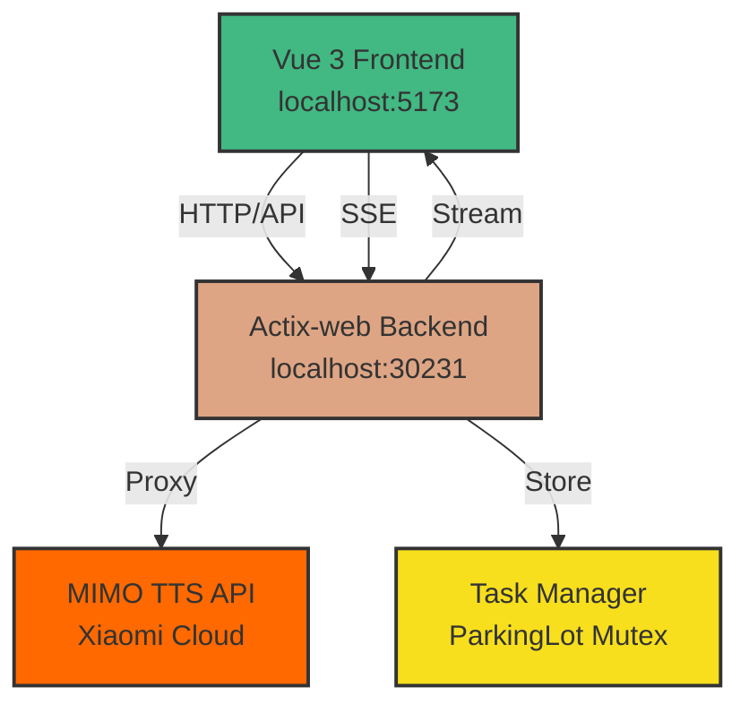

# MIMO v2.5 TTS Web 服务


基于 Rust + Actix-web + Vue 3 的小米 MIMO v2.5 TTS 语音合成 Web 服务

## 功能特性

- ✅ 完整的 TTS 合成工作流（文本 → 音频）
- ✅ 多任务并发管理与状态追踪
- ✅ 实时任务状态展示
- ✅ 音频在线播放与下载
- ✅ Token/字符实时统计
- ✅ 8 种预置音色切换
- ✅ 自然语言风格控制
- ✅ 完善的错误处理与重试
- ✅ 响应式现代化 UI
- ✅ 内存安全的异步 Rust 后端

## 技术亮点

### 1. 异步并发控制

使用 `tokio::sync::Semaphore` 限制同时合成的任务数，避免对 MIMO API 造成过大压力：

```rust
let semaphore = Arc::new(Semaphore::new(max_concurrent_tasks));
let permit = semaphore.acquire().await?;
// 执行合成任务
drop(permit); // 释放许可
```

### 2. 实时状态推送

基于 Server-Sent Events (SSE) 实现单向实时通信，相比 WebSocket 更轻量：

```rust
HttpResponse::Ok()
    .content_type("text/event-stream")
    .streaming(task_event_stream(task_id))
```

### 3. 内存安全的状态管理

使用 `Arc<Mutex<AppState>>` 确保多线程环境下的数据一致性：

```rust
pub struct AppState {
    pub tasks: HashMap<String, Task>,
    pub semaphore: Arc<Semaphore>,
}
```

### 4. 类型安全的前后端交互

TypeScript 接口与 Rust 结构体严格对应，编译时捕获类型错误：

```typescript
interface Task {
  id: string
  status: 'pending' | 'queued' | 'synthesizing' | 'completed' | 'failed'
  // ...
}
```

## 系统架构

本项目采用前后端分离架构：

- **前端**：Vue 3 + Vite 开发服务器，通过 HTTP API 与后端通信
- **后端**：Actix-web 异步 Web 框架，负责任务管理、并发控制、MIMO API 代理
- **实时通信**：使用 Server-Sent Events (SSE) 推送任务状态更新
- **并发控制**：基于信号量（Semaphore）限制同时合成任务数



## 技术栈

### 后端
- **Rust** + **Actix-web 4.x** - 高性能异步 Web 框架
- **tokio** - 异步运行时
- **reqwest** - HTTP 客户端（调用 MIMO API）
- **parking_lot** - 高性能并发原语
- **serde** - 序列化/反序列化

### 前端
- **Vue 3.5** + **Vite 6** - 现代化前端框架
- **TypeScript** - 类型安全
- **Tailwind CSS** - 原子化 CSS
- **Axios** - HTTP 客户端
- **Pinia** - 状态管理

## 快速开始

### 前置要求

- Rust 1.70+ (后端)
- Node.js 18+ (前端)
- MIMO API Key ([申请地址](https://platform.xiaomimimo.com/))

### 后端启动

```bash
cd backend

# 复制环境变量配置
cp .env.example .env

# 编辑 .env 文件，填入你的 MIMO_API_KEY
# MIMO_API_KEY=your_api_key_here

# 运行服务器
cargo run

# 或使用 watch 模式（需要 cargo-watch）
cargo watch -x run
```

后端服务将启动在 `http://localhost:30231`

### 前端启动

```bash
cd frontend

# 安装依赖
npm install

# 开发模式
npm run dev

# 生产构建
npm run build
```

前端开发服务器将启动在 `http://localhost:5173`

### 生产部署

```bash
# 构建前端
cd frontend
npm run build

# 后端服务静态文件
cd ../backend
cargo run --release
```

访问 `http://localhost:30231` 即可使用完整应用。

## API 文档

### TTS 合成

**请求**：

```bash
curl -X POST http://localhost:30231/api/v1/tts/synthesize \
  -H "Content-Type: application/json" \
  -d '{
    "text": "你好，世界",
    "voice": "冰糖",
    "model": "mimo-v2.5-tts",
    "context": "用温柔的语气"
  }'
```

**响应**（201 Created）：

```json
{
  "task_id": "a1b2c3d4-e5f6-7890-abcd-ef1234567890",
  "status": "pending",
  "token_count": 8,
  "char_count": 5,
  "message": "任务已创建，正在排队"
}
```

**错误响应**：

| 状态码 | 错误信息 | 原因 |
|--------|----------|------|
| 400 | `{"error": "文本不能为空"}` | text 字段缺失或为空 |
| 400 | `{"error": "无效的音色 ID"}` | voice 不在预置列表中 |
| 401 | `{"error": "API Key 无效"}` | MIMO_API_KEY 配置错误 |
| 429 | `{"error": "请求频率限制"}` | 超过 MIMO API 速率限制 |
| 500 | `{"error": "合成失败: ..."}` | MIMO API 返回错误 |

### 任务管理

#### 获取所有任务

**请求**：
```bash
curl http://localhost:30231/api/v1/tasks
```

**响应**（200 OK）：
```json
[
  {
    "id": "a1b2c3d4-e5f6-7890-abcd-ef1234567890",
    "status": "completed",
    "model": "mimo-v2.5-tts",
    "voice": "冰糖",
    "text": "你好，世界",
    "created_at": "2026-05-20T02:30:00Z",
    "completed_at": "2026-05-20T02:30:15Z",
    "error": null,
    "progress": 1.0,
    "token_count": 8,
    "char_count": 5,
    "elapsed_secs": 15.234,
    "has_audio": true
  }
]
```

#### 获取任务详情

**请求**：
```bash
curl http://localhost:30231/api/v1/tasks/{task_id}
```

**响应**：同上（单个任务对象）

#### 删除任务

**请求**：
```bash
curl -X DELETE http://localhost:30231/api/v1/tasks/{task_id}
```

**响应**（204 No Content）：无返回体

#### 下载音频

**请求**：
```bash
curl -O http://localhost:30231/api/v1/tasks/{task_id}/audio
```

**响应**（200 OK）：
- Content-Type: `audio/wav`
- 返回 WAV 格式音频文件二进制数据

**错误**：
- 404：任务不存在或音频未生成

### 音色列表

**请求**：
```bash
curl http://localhost:30231/api/v1/voices
```

**响应**（200 OK）：
```json
{
  "voices": [
    {
      "id": "冰糖",
      "name": "冰糖",
      "language": "中文",
      "gender": "女性",
      "style": "活泼少女",
      "preview_url": "https://aistudio-cdn.xiaomimimo.com/xiaomimimo-static/tts/audio/bingtang.wav"
    },
    // ... 其他 7 个音色
  ]
}
```

**注意**：
- `preview_url` 指向小米官方 CDN，支持 CORS 跨域访问
- 前端可直接使用该 URL 播放试听音频，无需后端代理

### SSE 实时推送

订阅任务状态变更事件：

**连接**：
```javascript
const eventSource = new EventSource('/api/v1/sse/tasks/{task_id}')

eventSource.onmessage = (event) => {
  const data = JSON.parse(event.data)
  console.log('事件类型:', data.event_type)
  console.log('进度:', data.progress)
  
  if (data.event_type === 'completed') {
    console.log('合成完成！')
    eventSource.close()
  }
}
```

**事件格式**：

```json
// 状态变更
{
  "task_id": "a1b2c3d4-...",
  "event_type": "status_changed",
  "progress": 0.5
}

// 完成
{
  "task_id": "a1b2c3d4-...",
  "event_type": "completed"
}

// 失败
{
  "task_id": "a1b2c3d4-...",
  "event_type": "failed",
  "error": "API 调用超时"
}
```

**事件类型**：
- `status_changed`：任务状态变更（pending → queued → synthesizing → streaming → completed）
- `completed`：合成完成，音频可用
- `failed`：合成失败，查看 error 字段

## 性能指标

### 基准测试

| 指标 | 数值 | 测试条件 |
|------|------|----------|
| 后端启动时间 | < 50ms | Release 模式，冷启动 |
| API 响应延迟（P50） | < 10ms | 本地网络，健康检查接口 |
| 并发任务上限 | 5 个 | 可配置（MAX_CONCURRENT_TASKS） |
| 内存占用（空闲） | ~15 MB | RSS，无活跃任务 |
| 内存占用（满载） | ~25 MB | RSS，5 个并发任务 |

### 优化建议

- **生产环境**：使用 `cargo run --release` 编译，性能提升 3-5 倍
- **并发调优**：根据 MIMO API 速率限制调整 `MAX_CONCURRENT_TASKS`
- **任务清理**：定期清理已完成的任务（默认 24 小时），避免内存泄漏

## 预置音色

| 音色 | 语言 | 性别 | 风格 |
|------|------|------|------|
| 冰糖 | 中文 | 女性 | 活泼少女 |
| 茉莉 | 中文 | 女性 | 知性女声 |
| 苏打 | 中文 | 男性 | 阳光少年 |
| 白桦 | 中文 | 男性 | 成熟男声 |
| Mia | English | Female | Lively girl |
| Chloe | English | Female | Sweet Dreamy |
| Milo | English | Male | Sunny boy |
| Dean | English | Male | Steady Gentle |

## 项目结构

```
UMMimoTTS/
├── backend/                     # Rust 后端
│   ├── src/
│   │   ├── main.rs              # 服务器入口、路由注册
│   │   ├── config.rs            # 环境变量配置
│   │   ├── models/              # 数据模型定义
│   │   │   ├── request.rs       # 请求数据结构
│   │   │   ├── response.rs      # 响应数据结构
│   │   │   └── task.rs          # 任务状态枚举
│   │   ├── services/            # 业务逻辑层
│   │   │   ├── mimo_client.rs   # MIMO API 客户端
│   │   │   └── task_manager.rs  # 任务管理器（并发控制）
│   │   ├── routes/              # API 路由处理
│   │   │   ├── tts.rs           # TTS 合成接口
│   │   │   ├── tasks.rs         # 任务管理接口
│   │   │   ├── voices.rs        # 音色列表接口
│   │   │   └── sse.rs           # SSE 实时推送
│   │   └── state/               # 应用全局状态
│   │       └── app_state.rs     # AppState（Arc<Mutex<...>>）
│   ├── Cargo.toml               # Rust 依赖配置
│   └── .env.example             # 环境变量模板
│
├── frontend/                    # Vue 前端
│   ├── src/
│   │   ├── App.vue              # 根组件（布局、主题切换）
│   │   ├── main.ts              # 应用入口
│   │   ├── api/
│   │   │   └── client.ts        # Axios 封装、API 方法
│   │   ├── components/          # 可复用组件
│   │   │   ├── SynthesizeForm.vue    # 合成表单（音色选择、文本输入）
│   │   │   ├── TaskListSidebar.vue   # 任务列表侧边栏
│   │   │   └── ApiConfigDialog.vue   # API 配置对话框
│   │   ├── stores/              # Pinia 状态管理
│   │   │   ├── task.ts          # 任务状态（创建、查询、删除）
│   │   │   ├── config.ts        # 配置状态（API Key）
│   │   │   └── theme.ts         # 主题状态（明亮/暗色）
│   │   └── composables/         # 组合式函数（预留）
│   ├── index.html               # HTML 模板
│   ├── vite.config.ts           # Vite 配置（代理、插件）
│   ├── tailwind.config.js       # Tailwind CSS 配置
│   └── package.json             # Node 依赖配置
│
├── LICENSE                      # MIT 许可证
├── README.md                    # 项目文档
└── .gitignore                   # Git 忽略规则
```

**关键模块说明**：

- **TaskManager**：使用 `parking_lot::Mutex` 和 `tokio::sync::Semaphore` 实现线程安全的任务队列和并发控制
- **MimoClient**：封装 MIMO API 调用，处理认证、重试、错误解析
- **SSE Handler**：基于 Actix-web 的 `HttpResponseBuilder` 实现流式响应
- **Pinia Stores**：集中管理应用状态，支持持久化（localStorage）

## 环境变量

| 变量 | 描述 | 默认值 |
|------|------|--------|
| `MIMO_API_KEY` | MIMO API 密钥 | (空) |
| `SERVER_PORT` | 服务器端口 | `30231` |
| `ALLOWED_ORIGINS` | CORS 白名单 | `http://localhost:5173` |
| `MAX_CONCURRENT_TASKS` | 最大并发任务数 | `5` |
| `TASK_CLEANUP_HOURS` | 任务清理时间（小时） | `24` |

## 开发说明

### 任务状态流转

```
Pending → Queued → Synthesizing → Streaming → Completed
                  ↓
                Failed (可重试)
```

### 并发控制

使用信号量（Semaphore）限制同时合成的任务数，避免对 MIMO API 造成过大压力。

### 错误处理

- 400: 请求参数错误
- 401: API Key 无效
- 429: 请求频率限制
- 500: 服务端错误

## 贡献指南

欢迎提交 Issue 和 Pull Request！

### 开发流程

1. **Fork 仓库**：点击右上角 Fork 按钮
2. **克隆仓库**：
   ```bash
   git clone https://github.com/your-username/UMMimoTTS.git
   cd UMMimoTTS
   ```
3. **创建分支**：
   ```bash
   git checkout -b feature/your-feature-name
   ```
4. **提交更改**：
   ```bash
   git commit -m "feat: add your feature description"
   ```
5. **推送分支**：
   ```bash
   git push origin feature/your-feature-name
   ```
6. **创建 PR**：在 GitHub 上提交 Pull Request

### 代码规范

- **Rust**：遵循 `rustfmt` 格式，运行 `cargo fmt` 和 `cargo clippy`
- **Vue**：使用 Composition API + `<script setup>`，遵循 Vue 最佳实践
- **提交消息**：使用 [Conventional Commits](https://www.conventionalcommits.org/) 规范

### 报告 Bug

请在 Issue 中提供：
- 清晰的标题和描述
- 复现步骤
- 预期行为和实际行为
- 环境信息（操作系统、Rust/Node 版本）

## 常见问题

### Q1: 如何获取 MIMO API Key？

访问 [MIMO 开放平台](https://platform.xiaomimimo.com/) 注册账号并申请 API Key。

### Q2: 为什么合成任务一直停留在 pending 状态？

检查以下几点：
1. 确认 `MIMO_API_KEY` 配置正确
2. 检查网络连接是否正常
3. 查看后端日志是否有错误信息
4. 确认未超过并发任务上限

### Q3: 如何修改最大并发任务数？

编辑 `backend/.env` 文件，设置 `MAX_CONCURRENT_TASKS` 变量：
```env
MAX_CONCURRENT_TASKS=10
```

### Q4: 前端无法连接后端？

确认：
1. 后端服务已启动（`http://localhost:30231`）
2. 前端 Vite 代理配置正确（`frontend/vite.config.ts`）
3. CORS 配置允许前端域名（`ALLOWED_ORIGINS`）

### Q5: 如何自定义音色列表？

编辑 `backend/src/routes/voices.rs` 文件，修改 `list_voices` 函数中的音色数据。

### Q6: 音频文件格式是什么？

WAV 格式，采样率 24kHz，单声道，16-bit PCM。

## 许可证

本项目采用 **MIT License** 开源协议。

详见 [LICENSE](LICENSE) 文件。

## 第三方资源声明

### 小米官方资源引用

本项目使用了以下来自小米官方的资源和材料：

1. **音色预览音频**
   - 来源：小米 MIMO TTS 官方 CDN
   - URL: `https://aistudio-cdn.xiaomimimo.com/xiaomimimo-static/tts/audio/`
   - 包含音色：冰糖、茉莉、苏打、白桦、Mia、Chloe、Milo、Dean
   - 版权：归小米公司所有

2. **音色头像图片**
   - 来源：小米 MiMo Studio 官方网站
   - 格式：WebP
   - 版权：归小米公司所有

3. **API 服务**
   - 服务提供方：小米 MIMO 开放平台
   - 文档：[MIMO API 文档](https://platform.xiaomimimo.com/docs/zh-CN/usage-guide/speech-synthesis-v2.5)
   - 使用需遵守小米开放平台服务条款

### 免责声明

- 本项目仅为技术演示和学习用途，非小米官方产品
- 所有音色相关资源（音频、图片）的版权归小米公司所有
- 使用本项目时需自行申请 MIMO API Key 并遵守小米开放平台的使用条款
- 本项目作者与小米公司无任何隶属关系
- 如因使用本项目产生的任何纠纷，由使用者自行承担

### 致谢

感谢小米公司提供优质的 TTS 服务和开发平台。

## 相关链接

- [MIMO 开放平台](https://platform.xiaomimimo.com/)
- [MIMO API 文档](https://platform.xiaomimimo.com/docs/zh-CN/usage-guide/speech-synthesis-v2.5)
- [MiMo-Skills GitHub](https://github.com/XiaomiMiMo/MiMo-Skills)
