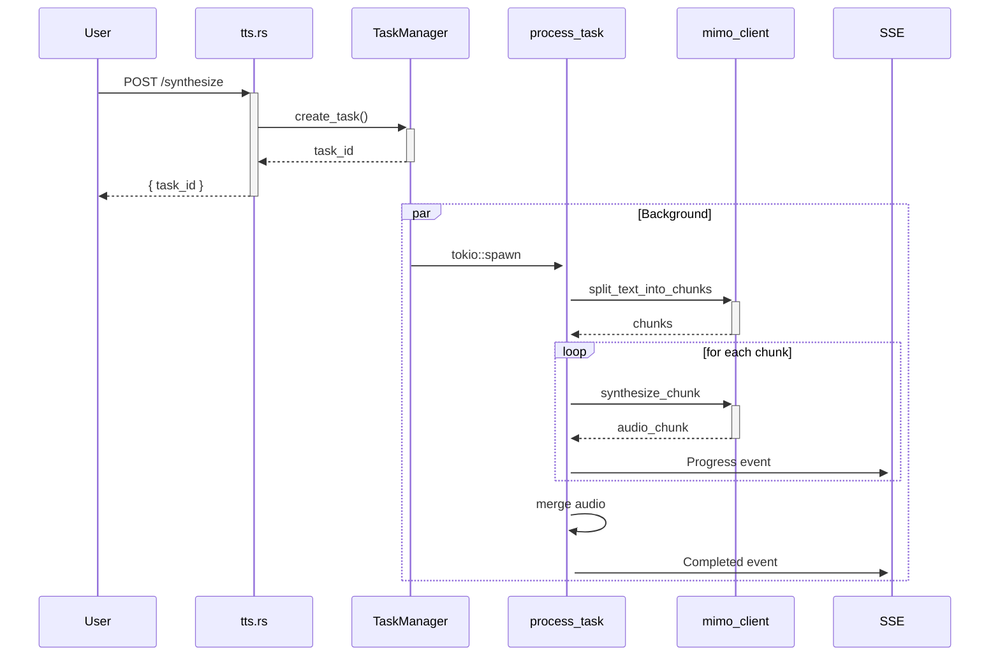
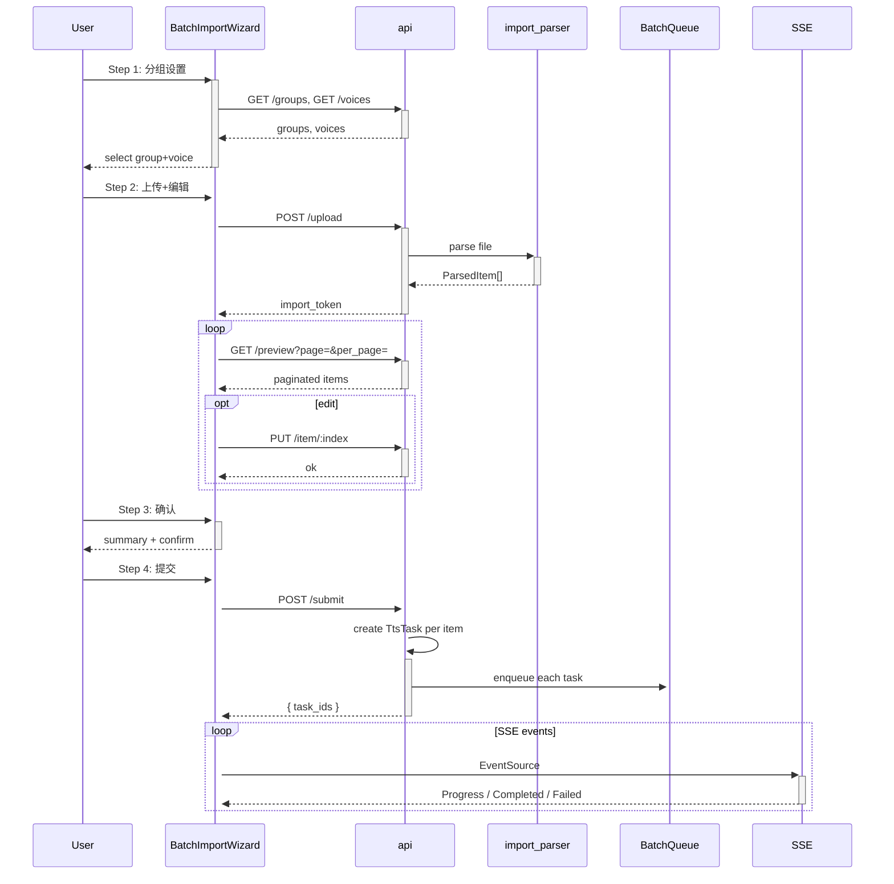

# UMMimoTTS 系统架构概览

> 最后更新: 2026-05-25

## 一、整体架构

```
┌──────────────────────────────────────────────────────────────┐
│                     Frontend (Vue 3 + TS)                    │
│  ┌────────────────────────────────────────────────────────┐  │
│  │  BatchImportWizard  │  TaskCard  │  GroupPanel  │ ...  │  │
│  │  4-step wizard      │  task list │  group mgmt  │      │  │
│  └────────────────────────────────────────────────────────┘  │
│              ↕ HTTP REST (axios) + SSE                       │
├──────────────────────────────────────────────────────────────┤
│                     Backend (Rust + actix-web)                │
│  ┌──────────┐ ┌──────────┐ ┌──────────┐ ┌──────────────┐   │
│  │ batch_imp│ │ tasks    │ │ groups   │ │ sse          │   │
│  │ ort      │ │ CRUD     │ │ CRUD+pr │ │ Server-Sent  │   │
│  │ (token)  │ │          │ │ ause/ret│ │ Events       │   │
│  └────┬─────┘ └────┬─────┘ └────┬─────┘ └──────┬───────┘   │
│       │            │            │              │            │
│  ┌────▼────────────▼────────────▼──────────────▼───────┐   │
│  │           AppState (mutex-guarded HashMaps)          │   │
│  │  ┌──────────┐ ┌───────────┐ ┌──────────────────┐    │   │
│  │  │ TtsTasks │ │ BatchGrou │ │ BatchImportMgr  │    │   │
│  │  │ (tasks)  │ │ ps        │ │ (token sessions) │    │   │
│  │  └──────────┘ └───────────┘ └──────────────────┘    │   │
│  └──────────────────────────────────────────────────────┘   │
│                        │                                     │
│  ┌─────────────────────▼─────────────────────────────────┐  │
│  │              BatchQueue (后台处理引擎)                  │  │
│  │  优先级队列 + 速率限制 + 熔断器 + 动态并发控制           │  │
│  │  ┌────────────┐  ┌────────────────┐                   │  │
│  │  │ TTS 任务    │→│ process_task   │                   │  │
│  │  │ 出队       │  │ split→合成→合并 │                   │  │
│  │  └────────────┘  └────────────────┘                   │  │
│  └────────────────────────────────────────────────────────┘  │
│                        │                                     │
│  ┌─────────────────────▼─────────────────────────────────┐  │
│  │              mimo_client (外部 API)                    │  │
│  │  LLM (文本处理) / TTS API (语音合成)                    │  │
│  └────────────────────────────────────────────────────────┘  │
├──────────────────────────────────────────────────────────────┤
│                     Storage                                  │
│  ┌────────────┐  ┌──────────────┐  ┌──────────────────────┐ │
│  │ sled (DB)  │  │ 文件系统     │  │ 内存 (TTL cache)     │ │
│  │ 持久化任务  │  │ 音频输出文件 │  │ PendingImport        │ │
│  └────────────┘  └──────────────┘  └──────────────────────┘ │
└──────────────────────────────────────────────────────────────┘
```

---

## 二、前端架构

### 2.1 技术栈

| 技术 | 用途 |
|------|------|
| Vue 3 (Composition API + `<script setup>`) | 框架 |
| TypeScript | 类型系统 |
| shadcn-vue (Radix UI) | UI 组件库 |
| @tanstack/vue-table | 表格组件 |
| @tanstack/vue-virtual | 虚拟滚动 |
| axois | HTTP 客户端 |
| EventSource | SSE 实时事件流 |
| Pinia | 状态管理 |

### 2.2 主要页面/组件

```
frontend/src/
├── api/
│   └── client.ts              # HTTP API 封装
├── stores/
│   ├── batch.ts               # Batch import Pinia store
│   ├── taskStore.ts           # 任务列表 store
│   └── groupStore.ts          # 分组管理 store
├── components/
│   ├── BatchImportWizard.vue  # 4-step 批量导入向导
│   ├── TaskCard.vue           # 单个任务卡片
│   ├── GroupPanel.vue         # 分组面板
│   └── ui/                    # shadcn-vue 组件
├── App.vue
└── main.ts
```

### 2.3 BatchImportWizard 流程 (核心)

```
Step 1: 分组设置 (Group Settings)
    - 选择分组 (groups list from API)
    - 选择音色 (voice selector)
    - → 下一步

Step 2: 导入+编辑 (Import & Edit)
    - 上传文件 (TXT/SRT)
    - 预览表格 (paginated, 50/page)
    - 行内编辑 (任务名/风格/音色)
    - → 下一步

Step 3: 确认 (Confirmation)
    - 显示汇总信息
    - → 提交

Step 4: 进度 (Progress)
    - 实时进度显示 (SSE)
    - 完成后关闭
```

### 2.4 API Client 关键类型

```typescript
interface ParsedItem {
  index: number
  text_preview: string
  voice: string | null
  model: string | null
  title: string | null
  char_count: number
  token_count: number
  has_error: boolean
  source_filename: string
  context?: string | null        // "风格"字段
}

interface ItemOverride {
  voice?: string | null
  model?: string | null
  context?: string | null        // 风格
  title?: string | null          // 任务名
}

interface PaginatedResponse<T> {
  items: T[]
  total: number
  page: number
  per_page: number
}
```

---

## 三、后端架构

### 3.1 模块结构

```
backend/
├── src/
│   ├── main.rs                 # actix-web 入口, 路由注册
│   ├── config.rs               # 配置 (端口, API key, 外部服务 URL)
│   ├── models.rs               # 数据模型 (TtsTask, BatchGroup, PendingImport 等)
│   ├── state.rs                # AppState 全局状态
│   ├── errors.rs               # 错误类型定义
│   ├── db.rs                   # sled 数据库操作
│   ├── routes/
│   │   ├── mod.rs              # 路由聚合
│   │   ├── batch_import.rs     # 批量导入 (token-based)
│   │   ├── batch.rs            # 旧版批量 (multipart)
│   │   ├── tasks.rs            # 任务 CRUD
│   │   ├── groups.rs           # 分组 CRUD + 暂停/恢复/重试
│   │   ├── stats.rs            # 统计信息
│   │   ├── sse.rs              # Server-Sent Events
│   │   ├── tts.rs              # 单条 TTS 合成
│   │   └── voices.rs           # 音色列表
│   ├── task_manager.rs         # 任务处理核心 (split, synthesize, merge)
│   ├── batch_queue.rs          # 后台批处理队列
│   ├── import_parser.rs        # 文件解析 (TXT, SRT)
│   └── mimoclient/             # 外部 API 客户端
│       ├── mod.rs
│       ├── client.rs           # HTTP client
│       ├── tts.rs              # TTS 合成 API
│       └── llm.rs              # LLM 文本处理 API
```

### 3.2 数据模型 (Data Models)

#### TtsTask (核心任务实体)

| 字段 | 类型 | 说明 |
|------|------|------|
| id | String | 任务 ID (UUID) |
| group_id | String | 所属分组 ID |
| title | String | 任务名 |
| text | String | 待合成文本 |
| voice | String | 音色 |
| model | String | 模型 |
| context | Option\<String\> | 风格/语境 |
| status | TaskStatus | 状态: pending/processing/done/failed/paused |
| progress | f64 | 0.0 ~ 1.0 |
| total_chunks | u32 | 总块数 (split 后) |
| current_chunk | u32 | 当前完成块数 |
| char_count | u32 | 字符数 |
| token_count | u32 | token 数 |
| audio_path | Option\<String\> | 输出音频路径 |
| error_message | Option\<String\> | 错误信息 |
| created_at | i64 | 创建时间戳 |
| updated_at | i64 | 更新时间戳 |

#### BatchGroup (分组)

| 字段 | 类型 | 说明 |
|------|------|------|
| id | String | 分组 ID |
| name | String | 分组名 |
| task_ids | Vec\<String\> | 关联的任务 ID 列表 |
| status | GroupStatus | pending/processing/done/failed/paused |
| progress | f64 | 0.0 ~ 1.0 |
| voice | Option\<String\> | 默认音色 |
| model | Option\<String\> | 默认模型 |
| created_at | i64 | |
| updated_at | i64 | |

#### PendingImport (临时导入会话)

| 字段 | 类型 | 说明 |
|------|------|------|
| token | String | 会话 token (UUID) |
| items | Vec\<ParsedItem\> | 解析后的条目 |
| group_id | String | 目标分组 |
| voice | String | 音色 |
| model | String | 模型 |
| created_at | i64 | |
| expires_at | i64 | TTL (默认 30 分钟) |

#### TaskEvent (SSE 事件)

```rust
enum TaskEvent {
  Progress { task_id, group_id, current_chunk, total_chunks, progress },
  Completed { task_id, group_id, audio_path },
  Failed { task_id, group_id, error },
  GroupProgress { group_id, progress, completed, total },
}
```

### 3.3 路由表

| 方法 | 路径 | 处理函数 | 说明 |
|------|------|----------|------|
| POST | /api/v1/batch_import/upload | upload_file | 上传并解析文件 |
| GET | /api/v1/batch_import/preview | get_preview | 获取预览 (paginated) |
| PUT | /api/v1/batch_import/item/:index | update_item | 更新条目属性 |
| DELETE | /api/v1/batch_import/file/:filename | remove_file | 移除已上传文件 |
| POST | /api/v1/batch_import/submit | submit | 提交所有条目 |
| GET | /api/v1/batch_import/extend | extend_session | 延长 TTL |
| POST | /api/v1/tts/synthesize | synthesize | 单条 TTS 合成 |
| GET | /api/v1/tasks | list_tasks | 任务列表 |
| GET | /api/v1/tasks/:id | get_task | 任务详情 |
| DELETE | /api/v1/tasks/:id | delete_task | 删除任务 |
| GET | /api/v1/tasks/:id/download | download_audio | 下载音频 |
| GET | /api/v1/groups | list_groups | 分组列表 |
| POST | /api/v1/groups | create_group | 创建分组 |
| PUT | /api/v1/groups/:id | update_group | 更新分组 |
| DELETE | /api/v1/groups/:id | delete_group | 删除分组 |
| POST | /api/v1/groups/:id/pause | pause_group | 暂停分组 |
| POST | /api/v1/groups/:id/resume | resume_group | 恢复分组 |
| POST | /api/v1/groups/:id/retry | retry_group | 重试失败任务 |
| GET | /api/v1/stats | get_stats | 统计信息 |
| GET | /api/v1/voices | list_voices | 音色列表 |
| GET | /api/v1/sse | sse_events | SSE 实时事件流 |

---

## 四、两大处理链路详解

### 链路一：单条 TTS 合成

```
用户 → POST /api/v1/tts/synthesize
  │
  ├── tts.rs::synthesize()
  │   ├── 解析请求 (text, voice, model, context)
  │   ├── TaskManager::create_task() → 创建 TtsTask
  │   ├── 存储到 AppState.tasks + db
  │   ├── tokio::spawn(process_task(task_id, ...))
  │   └── 返回 task_id（立即返回）
  │
  └── [后台] task_manager::process_task()
      │
      ├── 1. split_text_into_chunks(text, strategy)
      │    ├── 智能分块 (2K-3K tokens/块)
      │    ├── 句子边界感知 (不断句)
      │    └── 更新 TtsTask.total_chunks
      │
      ├── 2. synthesize_chunked_with_chunks(chunks, voice, model, context, progress_cb)
      │    ├── 逐块调用外部 TTS API
      │    ├── 每块完成后回调更新 progress
      │    │   - current_chunk += 1
      │    │   - progress = current_chunk / total_chunks
      │    │   - 发送 SSE TaskEvent::Progress
      │    │   - 更新 db
      │    └── 并行度: sequential (逐块)
      │
      ├── 3. 合并音频 (merge all chunks)
      │    └── 输出单个 .mp3/.wav 文件
      │
      └── 4. 更新状态
           ├── TtsTask.status = Done
           ├── TtsTask.audio_path = ...
           └── 发送 SSE TaskEvent::Completed
```

### 链路二：批量导入

```
用户 → 前端 BatchImportWizard
  │
  ├── Step 1: 分组设置
  │   ├── GET /api/v1/groups → 选择分组
  │   └── GET /api/v1/voices → 选择默认音色
  │
  ├── Step 2: 导入 + 编辑
  │   ├── POST /api/v1/batch_import/upload
  │   │   ├── 上传文件 (TXT/SRT)
  │   │   ├── import_parser::parse → Vec<ParsedItem>
  │   │   └── 存入 PendingImport (内存 TTL)
  │   │
  │   ├── GET /api/v1/batch_import/preview?page=&per_page=
  │   │   └── 分页返回 ParsedItem 列表
  │   │
  │   └── PUT /api/v1/batch_import/item/:index
  │       └── 更新 ParsedItem 属性
  │
  ├── Step 3: 确认 + 提交
  │   └── POST /api/v1/batch_import/submit
  │       │
  │       ├── batch_import::submit()
  │       │   ├── 遍历 PendingImport.items
  │       │   ├── 每个 item → 创建 TtsTask
  │       │   │   - task_id (UUID)
  │       │   │   - group_id = PendingImport.group_id
  │       │   │   - status = Pending
  │       │   │   - text = item.text (完整文本)
  │       │   │   - voice = item.voice ?? default
  │       │   │   - model = item.model ?? default
  │       │   │   - context = item.context
  │       │   │   - char_count, token_count
  │       │   ├── 存储到 AppState.tasks + db
  │       │   ├── 更新 BatchGroup.task_ids
  │       │   └── 每个任务 → BatchQueue.enqueue(task_id)
  │       │
  │       └── [后台] BatchQueue 调度
  │           ├── 优先级队列 (P0/P1/P2)
  │           ├── 速率限制 (令牌桶)
  │           ├── 熔断器 (circuit breaker)
  │           ├── 动态并发控制 (max_concurrency)
  │           ├── 分组感知 (支持暂停/恢复)
  │           └── 出队 → process_task (同链路一)
  │
  └── Step 4: 实时进度 (SSE)
      ├── 连接 GET /api/v1/sse
      ├── 接收 TaskEvent::Progress (task level)
      ├── 接收 TaskEvent::GroupProgress (group level)
      └── 接收 TaskEvent::Completed / Failed
```

---

## 五、关键组件详解

### 5.1 BatchQueue

```rust
struct BatchQueue {
  queue: PriorityQueue<TaskId, Priority>,
  rate_limiter: TokenBucket,
  circuit_breaker: CircuitBreaker,
  concurrency_controller: Semaphore,  // max_concurrency
  paused_groups: HashSet<GroupId>,
  // ...
}
```

特性：
- **优先级**: P0 (手动合成) / P1 (批量导入) / P2 (后台预生成)
- **速率限制**: 基于令牌桶，防止 API 限流
- **熔断器**: 连续失败达到阈值后暂停，冷却后自动恢复
- **动态并发**: 根据系统负载调整并行任务数
- **分组暂停**: 支持按组暂停/恢复/重试

### 5.2 TaskManager::process_task

核心处理函数，负责完成一个任务的完整生命周期：

1. **split_text_into_chunks**: 智能文本分块
   - 根据 token 估算 (需调用 LLM API 确认)
   - 保持句子完整性
   - 每块 2K-3K tokens
   - 更新 TtsTask.total_chunks

2. **synthesize_chunked_with_chunks**: 逐块合成
   - 顺序执行 (后一块依赖前一块的语音连贯性)
   - 每块完成后回调进度更新
   - 发送 SSE + 更新 db

3. **merge_audio**: 合并音频
   - 合并各块音频文件
   - 清理临时文件

### 5.3 SSE (Server-Sent Events)

```
客户端 → GET /api/v1/sse
  │
  └── 持久连接 (keep-alive)
      ├── 事件: TaskEvent::Progress
      │   ├── task_id
      │   ├── group_id
      │   ├── current_chunk / total_chunks
      │   └── progress (0.0 ~ 1.0)
      │
      ├── 事件: TaskEvent::Completed
      │   ├── task_id
      │   ├── group_id
      │   └── audio_path
      │
      ├── 事件: TaskEvent::Failed
      │   ├── task_id
      │   ├── group_id
      │   └── error
      │
      └── 事件: TaskEvent::GroupProgress
          ├── group_id
          ├── progress (aggregated)
          ├── completed_count
          └── total_count
```

---

## 六、已发现的架构缺口 (Gaps)

### Gap A (已修复): BatchQueue 未入队

- **位置**: `routes/batch_import.rs` - `submit()` 函数
- **问题**: submit 创建 TtsTask 后直接返回，未将任务加入 BatchQueue，导致任务状态永远停留在 "Pending"
- **修复**: 在 submit 返回前调用 `batch_queue.enqueue(task_id)`
- **状态**: ✅ 已修复

### Gap B (已修复): 前端缺少逐块进度显示

- **位置**: 前端 `BatchImportWizard.vue` Step 4
- **问题**: SSE 收到 `TaskEvent::Progress` 但 UI 只显示整体进度百分比，未显示 `current_chunk / total_chunks` 的逐块进度
- **修复**: Step 4 UI 增加逐块进度显示
- **状态**: ✅ 已修复

### Gap C (已修复): 缺少 Preload 预加载阶段

- **位置**: `batch_import.rs` - 缺少在 submit 前预览任务分组情况的独立 API
- **问题**: 用户点击 "提交" 前，无法直观看到所有文件解析后的条目数、分组情况和 token 总量概览
- **修复**: Step 3 确认页增加汇总展示
- **状态**: ✅ 已修复

### ~~Gap D: SubSingleTask 分片尚未实现~~

- **问题**: 当前 `process_task` 使用 `split_text_into_chunks` 在合成阶段进行文本分块。该分块是临时性的、任务内部的。没有持久化的 SubSingleTask 概念。
- **实际分析**: 当前实现将文本分块作为处理过程中的内部步骤（`process_task` 内 `split_text_into_chunks`），而不是一个独立、持久的数据模型。这是一个合理的简化设计——不需要在数据库中持久化子任务实体，分块发生在合成过程中并实时报告进度。并非架构缺口。

### Gap E: 错误恢复机制不足

- **问题**: 当某个 chunk 合成失败时，整个任务失败。缺少重试机制、断点续传和部分失败处理。
- **影响**: 长文本任务 (20+ chunks) 中单个 chunk 失败意味着全部重来
- **优先级**: 低

### Gap F: 缺少任务取消/删除时清理后台队列

- **位置**: `routes/tasks.rs` - `delete_task`
- **问题**: 删除任务时仅移除了存储数据，未从 BatchQueue 中移除尚未开始处理的排队任务
- **优先级**: 低

---

## 七、数据流图 (Data Flow Summary)

### 单条 TTS



### 批量导入


